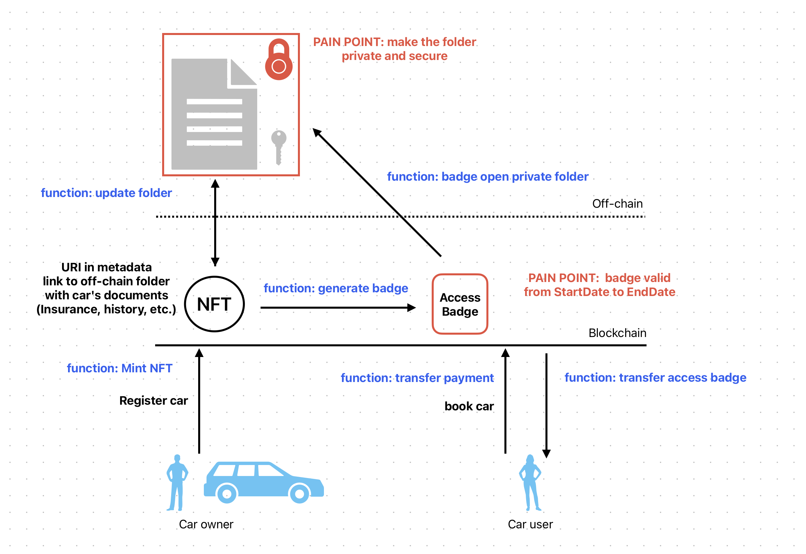

# Partage - Web3 Car-Sharing
This repository contains the first version of Partage Car-Sharing on the Radix blockchain. Close to GetAround in terms of functionality, Partage Car-Sharing aims to improve the current sharing economy applications by leveraging the best of blockchain technology: decentralization, data privacy, self-sovereignty, and a more equitable distribution of economic benefits. 

In short, this smart contract allows users to rent cars owned by other users. 

#### Key features:
1. Car NFTs: Each car is represented on the blockchain by an NFT containing metadata such as the car model, construction year, mileage, location and rental price.

2. Badges: Special badges are issued to authenticate car owners and users.
- Owner Badge: Represents car owners, required to add new cars to the system (mint car NFTs). This badge request also allows us to validate a proof of identity, and ownership of a vehicle. 
- User Badge: Represents users willing to rent cars. It proves a valid user information and driving license details. 
- Rental Badge: Temporarily granted to users when they rent a car. It contains the car NFT ID, user badge ID, start time and rental duration. 

3. Immutable Ownership: Only the car owner can add new cars to the platform and mint badges to grant user access.

4. Secure Transactions: All interactions, from car rentals to returns, are handled via the contract’s defined methods. 

#### Smart Contract Functionality:
1. Instantiation
When the contract is instantiated via the "instantiate_car_sharing" function, the following resources are created:
- Car NFTs: a set of predefined car NFTs is minted and stored in the contract's vault. 
- Resource Manager: Manages badges for owners, users and rentals. 

2. Minting Badges
- Owner Badges: issued to owners via the "mint_car_owner_badge" function. It grants the ability to add new cars to the platform.
- User Badges: issued to users via the "mint_user_badge" function. It allows users to rent cars on the platform.
- Rental Badges: When a car is rented, a temporary rental badge is created via the "mint_rental_badge" function. It allows the user to access the car for the specific duration of the rental period. When the rental period ends, the badge expires and is burned upon car return.

3. Car Management
- Add Car: car owners with a valid Car Owner Badge can add cars to the platform via the "add_car" method. Each car is represented as an NFT and stored in the contract's vault.
- List Cars: the "list_available_cars" method allows users to see all available cars for rent.
- Rent Car: users with a valid User Badge can rent cars by calling the "rent_car" method. The contract checks for car availability, issues a rental badge, and transfers the car NFT to the user for the rental period. 
- Return Car: when the rental period ends, the user must return the car via the "return_car" method, which burns the rental badge and transfers the car NFT back to the contract's vault. 

4. Roles and permissions:
- The Platform Owner holds an Owner Badge, required to perform restricted administrative tasks such as adding new Cars to the platform, or minting Car Owner Badges and User Badges. There can be only one Platform Owner per smart contract deployed.
- The Car Owner holds a Car Owner Badge to list cars via "add_car" function. One car owner cannot rent cars, but can manage one's own listed cars. 
- The User holds a User Badge, allowing to interact with the "rent_car" function. Once one user finished using a car, one must return the car using the "return_car" function.

