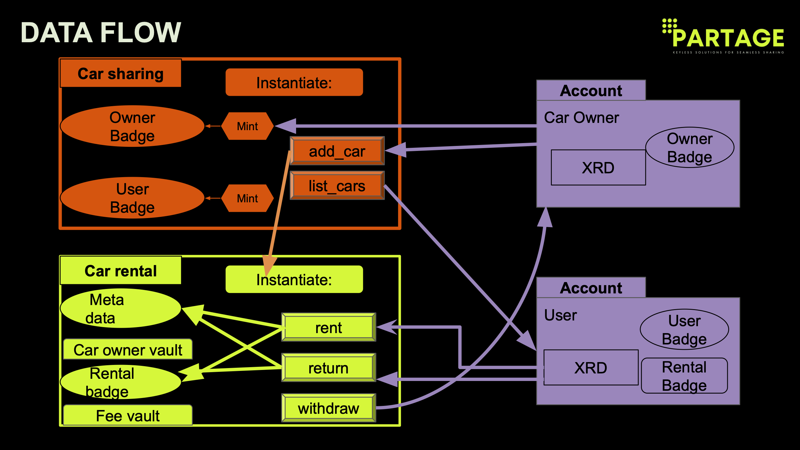

# Partage - Web3 Car-Sharing Platform

Partage Car-Sharing will to improve the existing sharing economy services by leveraging the best features of blockchain technology: decentralization, data privacy, self-sovereignty, and a more equitable distribution of economic benefits.

Close to getAround in terms of functionality, Partage Car-Sharing allows users to rent cars owned by other users, generating a passive income from low-risk investments on one side, and unlocking cars on-demand everywhere in the world on the other side.

Request an early access at https://partage.xyz

- 3-minute pitch: https://www.youtube.com/watch?v=_ar2LtNWE1c 
- 5-minute code demo https://youtu.be/h6x220Rn5xc 

#### Key features

1. Car NFTs: Each car is represented on the blockchain by an NFT containing metadata such as the car model, construction year, mileage, location and rental price. These NFTs provide a unique, verifiable digital identity for each car.

2. Badges:

- Owner Badge: Issued to car owners, this badge is required to add new cars to the system and mint car NFTs. It serves as proof of car ownership, identity verification, and is necessary for listing cars on the platform.
- User Badge: This badge is issued to users who want to rent cars. It verifies the user’s identity, ensuring they have provided valid user information and driving license details.
- Rental Badge: Temporarily granted to users when they rent a car. This badge tracks important information such as the rental’s start time, duration, and is burned when the car is returned.

3. Immutable Ownership: Only verified car owners with valid Owner Badges can add new cars to the platform and manage car listings. This ensures that only the rightful owner can interact with the car’s metadata and rental activities.

4. Secure Transactions: All interactions, from renting to returning a car, are securely handled through the contract’s defined methods. Each transaction is trustless, utilizing badges and NFTs to maintain clear ownership and access rights.

#### Smart Contract Functionality

1. Instantiation:
The smart contract is initialized through the "instantiate_car_sharing" function, which creates the foundational resources:

- Component Owner Badge: A special badge given to the platform owner for administering the system.
- Badge Resource Managers: Manage badges for car owners, users and rental transactions.

2. Minting Badges:

- Owner Badges: Minted via the create_car_owner_account method, allowing verified car owners to add cars and manage their listings on the platform.
- User Badges: Minted through the create_user_account function, providing users with the ability to rent cars and interact with the system.
- Rental Badges: Created when a car is rented using the rent_car method. These badges allow users to use the car for the specified rental period and are burned once the car is returned.

3. Car Management

- Add Car: Car owners, who hold valid Owner Badges, can list their cars on the platform via the add_car method. Each car is represented as an NFT, containing detailed metadata about the vehicle.
- Rent Car: Users with a valid User Badge can rent a car through the rent_car method. The system checks the car’s availability, issues a Rental Badge, and transfers the car NFT to the user for the rental period. The user is charged for the rental, including a platform fee.
- Return Car: After the rental period ends, users must return the car using the return_car method. This burns the Rental Badge and transfers the car NFT back to the contract’s vault.

4. Data Flow:

- Car NFTs: These serve as the digital identity of each car on the platform. Each car’s metadata, including make, model, VIN, and price, is stored within the NFT, and the NFT is transferred between the platform and users during rentals.
- Badges: Badges represent different roles and permissions within the system:
  - The Owner Badge grants the ability to list cars and manage their details.
  - The User Badge allows users to rent cars.
  - The Rental Badge temporarily grants users the right to use a specific car for a rental period.
- Transactions: The platform handles rental payments by transferring funds between users and car owners. A fee is deducted from the payment to support the platform.

5. Roles and permissions:

- Platform Owner: Holds the Component Owner Badge, allowing them to administer the platform. The platform owner can mint Car Owner and User Badges.
- Car Owner: Holds the Car Owner Badge, enabling them to list their vehicles on the platform. Car owners manage their listings but cannot rent cars themselves.
- User: Holds the User Badge, allowing them to rent cars. Once the user finishes using the car, they must return it via the return_car function.
